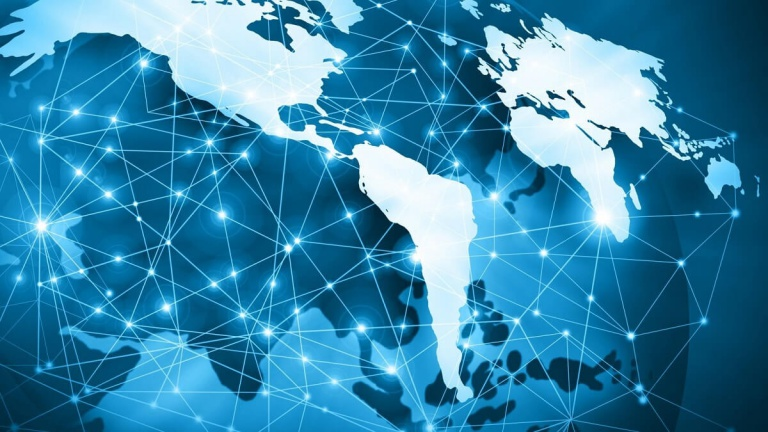

# Internet y sus plataformas

 
  
  ???
  
## Definición de internet:

## Definición de la World Wide Web (WWW):

## Diferencia entre internet y la World Wide Web (WWW):

## Definiciones de conceptos como http, url, etc:

## Plataformas de Internet

## ¿Qué es una plataforma de internet?

## Funciones de una plataforma

## ¿Cuáles son?
